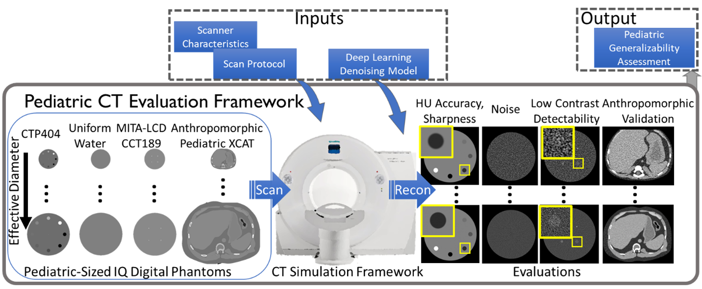

# pediatricIQphantoms

Digital Pediatric Image Quality Phantoms for Evaluating CT Denoising Methods

Please visit our Zenodo page to download the full dataset:

The set of Digital Phantoms for Pediatric CT Performance Assessment consists of analytical quality assurance phantom models and interfaces to CT simulation frameworks to generate simulated CT images representing different diameters of each phantom.

The phantoms incude:

1. The CTP404 contrast module phantom for assessing CT number accuracy and contrast-dependent spatial resolution
2. CCT189 the MITA LCD phantom for assessing low contrast detectability
3. Uniform water phantoms for assessing noise and noise texture

In addition, this repo contains examples of measurements using these digital image quality phantoms

1. phantom creation and simulation, including different scanner configurations and acquisition protocols
2. noise and noise texture measurements
3. sharpness measurements
4. low contrast detectability measurements using [lcd-ct](https://github.com/DIDSR/LCD_CT)