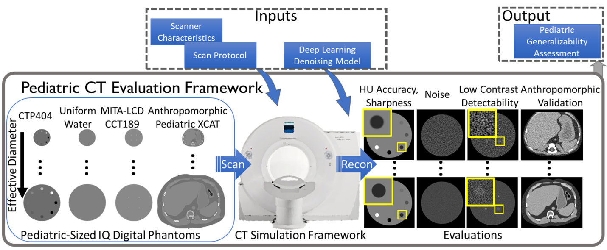
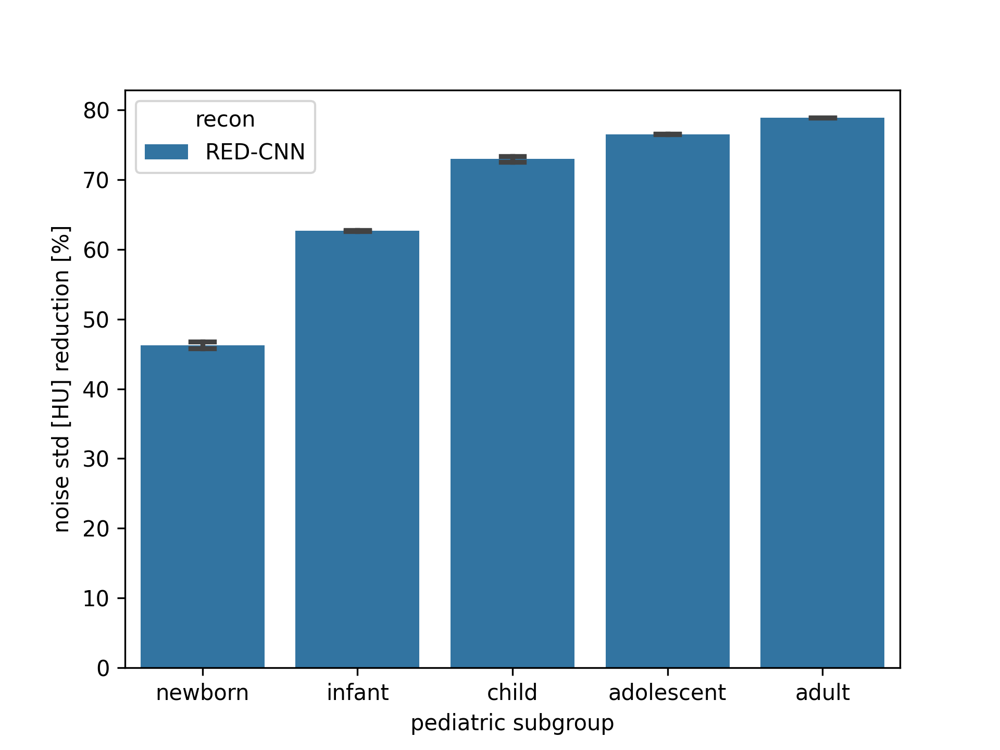

pediatricIQphantoms
===================

|zenodo| |docs| |tests|

**Digital Pediatric Image Quality Phantoms for Evaluating CT Denoising Methods** are a set of digital phantoms and simulation methods for generating CT images of standard image quality (IQ) phantoms designed to span the effective diameter of pediatric patients ranging from newborns to teenagers. This repository has `tools <make_phantoms.py>`_ for generating `MITA-LCD phantom <https://www.phantomlab.com/catphan-mita>`_ and a multi-contrast sensitometry module similar to the CTP404 module of the `Catphan 600 phantom <https://www.phantomlab.com/catphan-600>`_. Functions are also provided to simulate different acquisition parameters and CT scanner models.

.. |zenodo| image:: https://zenodo.org/badge/DOI/10.5281/zenodo.10064035.svg
    :alt: Zenodo Data Access
    :scale: 100%
    :target: https://zenodo.org/doi/10.5281/zenodo.10064035

.. |docs| image:: https://readthedocs.org/projects/pediatriciqphantoms/badge/?version=latest
    :alt: Documentation Status
    :scale: 100%
    :target: https://pediatriciqphantoms.readthedocs.io/en/latest/?badge=latest

.. |tests| image:: https://github.com/DIDSR/pediatricIQphantoms/actions/workflows/python-package-conda.yml/badge.svg?branch=main
    :alt: Package Build and Testing Status
    :scale: 100%
    :target: https://github.com/DIDSR/pediatricIQphantoms/actions/workflows/python-package-conda.yml

Features
--------

- The CTP404 contrast module phantom for assessing CT number accuracy and contrast-dependent spatial resolution
- CCT189 the MITA LCD phantom for assessing low contrast detectability
- Uniform water phantoms for assessing noise and noise texture

In addition, this repo contains examples of measurements using these digital image quality phantoms including:

1. `running simulations interactively with python <https://github.com/DIDSR/pediatricIQphantoms/blob/main/notebooks/00_running_simulations.ipynb>`_
2. `viewing the simulated dataset <https://github.com/DIDSR/pediatricIQphantoms/blob/main/notebooks/01_viewing_images.ipynb>`_ 
3. `evaluating pediatric generalizability of denoisers <https://github.com/DIDSR/pediatricIQphantoms/blob/main/notebooks/02_pediatric_denoising_evaluation.ipynb>`_

Example from the `uniform phantom denoising performance assessment notebook <https://github.com/DIDSR/pediatricIQphantoms/blob/main/notebooks/02_pediatric_denoising_evaluation.ipynb>`_ demonstrating the pediatric subgroup denoising performance of a `RED-CNN <https://ieeexplore.ieee.org/document/7947200/>`_ image-based deep learning denoiser using the `pediatricIQphantoms dataset <https://zenodo.org/doi/10.5281/zenodo.10064035>`_

4. `Command line usage for phantom creation and simulation <demo_01_phantom_creation.sh>`_

  - demonstrates command line usage including simulating different scanner configurations and acquisition protocols
  - run with `bash demo_01_phantom_creation.sh`

5. `Command line usage for more complex simulation experiments with changing acquisition parameters <demo_02_multiple_recon_kernels.sh>`_

Start Here
----------

*Installation is only required to generate new datasets*, a pregenerated dataset can be downloaded from `Zenodo <https://zenodo.org/doi/10.5281/zenodo.10064035>`_, only proceed if you want to generate new simulated datasets.

.. _version requirements:

**Requirements** 

- `Conda <https://docs.conda.io/projects/conda/en/stable/user-guide/getting-started.html>`_ package manager e.g. `Miniconda <https://docs.anaconda.com/free/miniconda/>`_
- Mac, Linux, or `Windows Subsystem for Linux (WSL) <https://learn.microsoft.com/en-us/windows/wsl/install>`_ operating systems described on the `Octave Conda Forge page <https://anaconda.org/conda-forge/octave>`_. This package currently uses the Octave-based `Michigan Image Reconstruction Toolbox (MIRT) <https://github.com/JeffFessler/mirt>`_

.. _installation:

**Installation**

.. code-block:: shell

        git clone https://github.com/DIDSR/pediatricIQphantoms
        cd pediatricIQphantoms
        conda env create --file environment.yml
        conda activate pediatricIQphantoms

The code block above does the following in 4 lines:

1. Git clones the `pediatricIQphantoms <https://github.com/DIDSR/pediatricIQphantoms>`_ repository

2. Changes the active directory to the repo

3. Creates a new conda environment called "pediatricIQphantoms"

4. Activates the conda environment. This makes the phantom creation library `pediatricIQphantoms` accessible in scripts (see `examples <notebooks/00_running_simulations.ipynb>`_) and via command line calls (see `demo 01 <demo_01_phantom_creation.sh>`_ and `demo 02 <demo_02_multiple_recon_kernels.sh>`_).

**Test the Installation**

.. code-block:: shell

        pytest

This runs the `unit tests <https://github.com/DIDSR/pediatricIQphantoms/tree/main/tests>`_ to verify that installation was successful.

**Running Notebooks**

To run the `computational notebooks <https://github.com/DIDSR/pediatricIQphantoms/tree/main/notebooks>`_ you will need to have `jupyter <https://jupyter.org/>`_ installed

.. code-block:: shell

        conda install jupyterlab -y

How to use this repo and the Pediatric IQ Phantoms
--------------------------------------------------

**pediatricIQphantoms `Documentation`_** provides further details on the `rationale <https://pediatriciqphantoms.readthedocs.io/en/latest/usage.html#intended-purpose>`_, usage, and examples for how to use the pediatric IQ phantoms, (available to download and use directly from `Zenodo <https://zenodo.org/doi/10.5281/zenodo.10064035>`_) or generate new phantom instances using the provided `phantom generation functions <src/pediatricIQphantoms/make_phantoms.py>`_.

Several examples are provided on how to use these functions:

- Check out the `usage <https://pediatriciqphantoms.readthedocs.io/en/latest/usage.html>`_ section for detailed information on customizing dataset running_simulations.
- See the `tests directory <tests>`_ for simple script examples
- `Computational notebooks <https://github.com/DIDSR/pediatricIQphantoms/tree/main/notebooks>`_ have also been provided to demonstrate how to use `pediatricIQphantoms dataset <https://zenodo.org/doi/10.5281/zenodo.10064035>`_ including:

  - `running CT simulations <https://github.com/DIDSR/pediatricIQphantoms/blob/main/notebooks/00_running_simulations.ipynb>`_
  - `options for viewing the dataset images <https://github.com/DIDSR/pediatricIQphantoms/blob/main/notebooks/01_viewing_images.ipynb>`_
  - `using the dataset to assess denoising performance in pediatric subgroups <https://github.com/DIDSR/pediatricIQphantoms/blob/main/notebooks/02_pediatric_denoising_evaluation.ipynb>`_

Contribute
----------

`Issue Tracker <https://github.com/DIDSR/pediatricIQphantoms/issues>`_ | `Source Code <https://github.com/DIDSR/pediatricIQphantoms>`_ | `Contributing Guide <https://pediatriciqphantoms.readthedocs.io/en/latest/contributing.html>`_

Support
-------

For questions that cannot be addressed in the supporting `Documentation`_

If you are having issues, please let us know.
`brandon.nelson@fda.hhs.gov <mailto:brandon.nelson@fda.hhs.gov>`_; `rongping.zeng@fda.hhs.gov <rongping.zeng@fda.hhs.gov>`_

.. _Documentation: https://pediatriciqphantoms.readthedocs.io/en/latest/

Disclaimer
----------
**About the Catalog of Regulatory Science Tools**

The enclosed tool is part of the [Catalog of Regulatory Science Tools](https://cdrh-rst.fda.gov/), which provides a peer-reviewed resource for stakeholders to use where standards and qualified Medical Device Development Tools (MDDTs) do not yet exist. These tools do not replace FDA-recognized standards or MDDTs. This catalog collates a variety of regulatory science tools that the FDA’s Center for Devices and Radiological Health’s (CDRH) Office of Science and Engineering Labs (OSEL) developed. These tools use the most innovative science to support medical device development and patient access to safe and effective medical devices. If you are considering using a tool from this catalog in your marketing submissions, note that these tools have not been qualified as [Medical Device Development Tools](https://www.fda.gov/medical-devices/medical-device-development-tools-mddt) and the FDA has not evaluated the suitability of these tools within any specific context of use. You may [request feedback or meetings for medical device submissions](https://www.fda.gov/regulatory-information/search-fda-guidance-documents/requests-feedback-and-meetings-medical-device-submissions-q-submission-program) as part of the Q-Submission Program.
For more information about the Catalog of Regulatory Science Tools, email [RST_CDRH@fda.hhs.gov](mailto:RST_CDRH@fda.hhs.gov).

Tool Reference 
--------------

- RST Reference Number: RST26MD02.01
- Date of Publication: 5/4/2026
- Recommended Citation: Recommended Citation: U.S. Food and Drug Administration. (2026). Pediatric IQ Phantoms: Digital Pediatric Image Quality Phantoms and Simulations for Evaluating CT Denoising Methods (RST26MD02.01). https://cdrh-rst.fda.gov/pediatric-iq-phantoms-digital-pediatric-image-quality-phantoms-and-simulations-evaluating-ct

Additional Resources
--------------------

- https://github.com/DIDSR/LCD_CT
